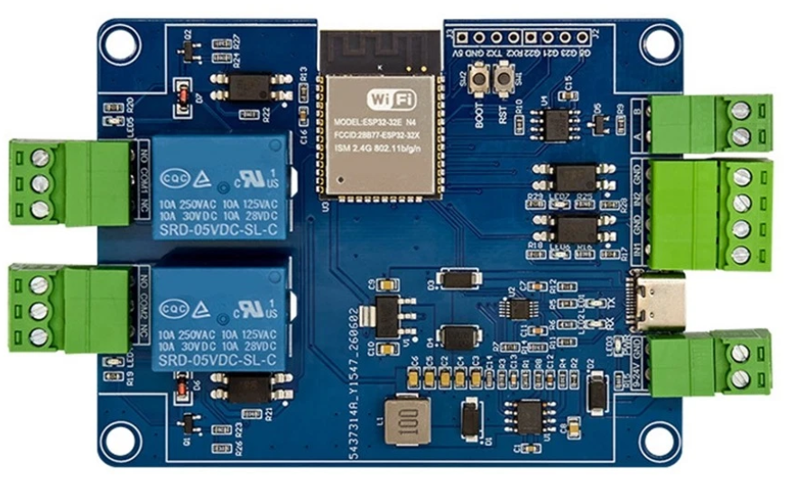
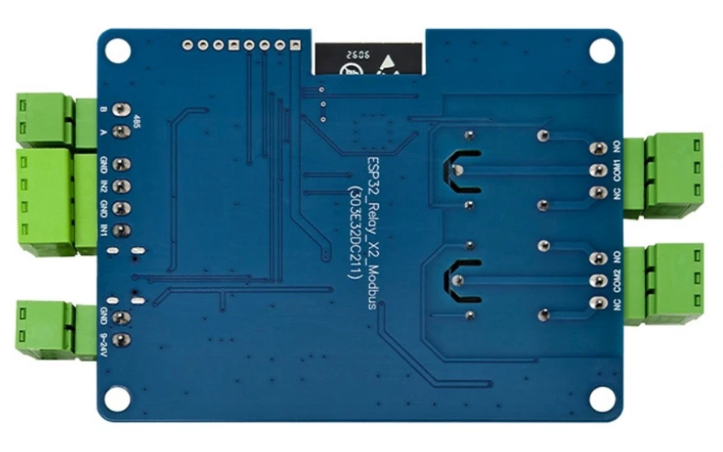

## Product description

This is a 2-relay board, having 2 binary inputs and an RS485 interface based on ESP32. The inputs are optoisolated (mine
came with TLP785GB with 4.7k resistors on inputs, making it safe to operate them around max 24V), with a common ground,
independent from the board's main gound. The RS485 transceiver is a SP3485E. Connectors are detacheable.

This appears to be a close relative to the ESP32_Relay_X4_Modbus_V1.3

I bought it from: [https://www.ebay.co.uk/itm/198658928427](https://www.ebay.co.uk/itm/198658928427)

## GPIO Pinout

| Pin    | Function  |
| ------ | --------- |
| GPIO33 | Relay 1   |
| GPIO25 | Relay 2   |
| GPIO27 | Input 1*  |
| GPIO26 | Input 2*  |
| GPIO19 | RS485 TX  |
| GPIO18 | RS485 RX  |
| GPIO32 | RS485 DE* |
| GPIO15 | LED       |
| GPIO16 | Pad RX2   |
| GPIO17 | Pad TX2   |
| GPIO5  | Pad G5    |
| GPIO21 | Pad G21   |
| GPIO22 | Pad G22   |
| GPIO23 | Pad G23   |

Footnote * - Pin TBC

All pins are inverted. It also exposes GPIOs 5, 21, 22, 23 labelled appropriately on the board.

## Basic Config

```yaml
substitutions:
  device_name: esp32-relay-x2_modbus-v1-1

esphome:
  name: ${device_name}

esp32:
  variant: esp32
  framework:
    type: esp-idf

logger:
  baud_rate: 0

api:
  reboot_timeout: 30min
  encryption:
    key: !secret encryption_key

ota:
  - platform: esphome
    password: !secret ota_password

web_server:
  port: 80

wifi:
  ssid: !secret wifi_ssid
  password: !secret wifi_password
  reboot_timeout: 30min

sensor:
  - platform: uptime
    name: Uptime

button:
  - platform: restart
    name: Reboot
  - platform: safe_mode
    name: Reboot in safe mode

# ==========================
# RELAYS (OUTPUTS)
# ==========================
switch:
  - platform: gpio
    pin:
      number: 33
      inverted: true
    name: "Relay 1"

  - platform: gpio
    pin:
      number: 25
      inverted: true
    name: "Relay 2"

# ==========================
# INPUTS (BINARY SENSORS)
# ==========================
binary_sensor:
  - platform: gpio
    pin:
      number: 27 # TBC
      inverted: true
    name: "Input 1"

  - platform: gpio
    pin:
      number: 26 # TBC
      inverted: true
    name: "Input 2"

  # ==========================
  # EXTRA PADS (RX2/TX2)
  # ==========================
  - platform: gpio
    pin:
      number: 16
      inverted: true
      mode: INPUT_PULLUP
    name: "Pad RX2 as input"

  - platform: gpio
    pin:
      number: 17
      inverted: true
      mode: INPUT_PULLUP
    name: "Pad TX2 as input"

  - platform: gpio
    pin:
      number: 5
      inverted: true
      mode: INPUT_PULLUP
    name: "Pad G5 as input"

  - platform: gpio
    pin:
      number: 23
      inverted: true
      mode: INPUT_PULLUP
    name: "Pad G23 as input"

  - platform: gpio
    pin:
      number: 21
      inverted: true
      mode: INPUT_PULLUP
    name: "Pad G21 as input"

  - platform: gpio
    pin:
      number: 22
      inverted: true
      mode: INPUT_PULLUP
    name: "Pad G22 as input"

# ==========================
# RS485 (MODBUS) UART
# ==========================
uart:
  rx_pin: 18 # RS485 RX
  tx_pin: 19 # RS485 TX
  flow_control_pin: 32 # RS485 DE (TBC)
  baud_rate: 9600
```
